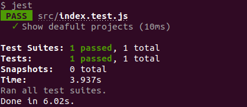

# JavascriptTodoList

This project is a basic To-Do List app developed with JavaScript. Features includes the ability to create new projects and todos for each project. Each to-do includes title, description, due date, and priority properties.

The project proposed is in the next link:
<a href="https://www.theodinproject.com/courses/javascript/lessons/todo-list">PROJECT: TODO LIST</a>


## Author:
👤 **Gonza Javier Mancilla**

- Github: [@gonjavi](https://github.com/gonjavi)
- Linkedin: [@g-javier-mancilla](https://www.linkedin.com/in/g-mancillla)

<h2>Live version:</h2> 
<a href="https://gonjavi.github.io/JavascriptTodoList/">Live Demo Link</a>

## Tools Used
```bash
  HTML5
 ```
 ```bash
   JavaScript - ES6
 ```
  ```bash
   Materialize-CSS Framework
 ```
  ```bash
   npm 6.13.4
 ```
  ```bash
   Stickler
```

 ## Getting started
```bash
Create folder
```
* Inside the folder Run:
```bash
$npm init webpack webpack.cli --save-dev
```
* To build it run:
```bash
$ npm run build or $npm run watch
```
Open the app on the browser

## Usage

- To create a project, just type the name of the project on the left hand side and press the New Project button.

- To create a to-do, select the project on the right hand side and fill in its information. Then click on Create To-Do.

- To check the to-do created, click on the project on the left hand side and the lists of to-dos will appear in the white space in the middle column.

## Testing

To run the test go to the command line, and type one of the commands:

 - $yarn test 
 
 - $npm run test
  
  You will see the test result:



## Future Updates/Improvements

- Update the user interface design

- Hide the ToDo form

- Add a New ToDo button

- Display the ToDo form only when the user clicks on Add New ToDo

## 🤝 Contributing

Contributions, issues and feature requests are welcome!


## Show your support

Give a ⭐️ if you like this project!


## 📝 License

This project is [MIT](lic.url) licensed.

