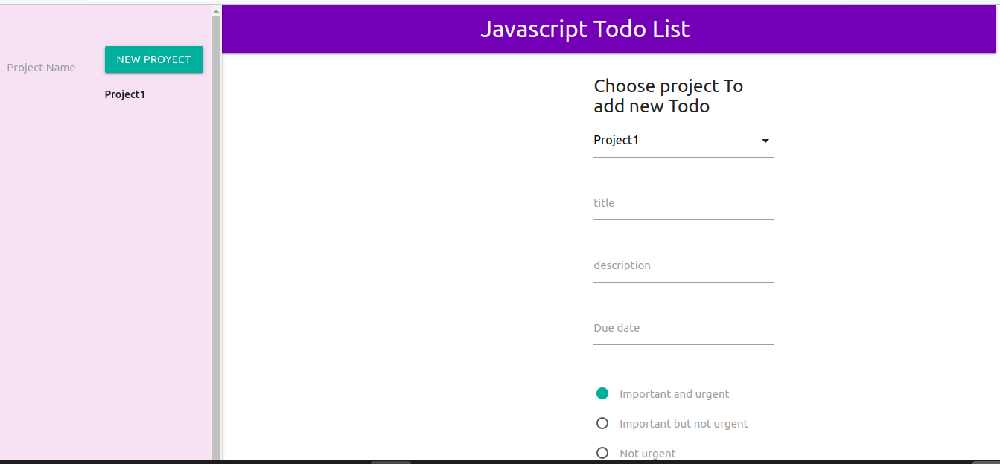

# JavascriptTodoList

This project is a basic todo list app developed with JavaScript, which includes: creating new projects, and todos dynamically for each project. The todos include the properties: title, description, due date, and priority.

The project proposed is in the link below:
<a href="https://www.theodinproject.com/courses/javascript/lessons/todo-list">PROJECT: TODO LIST</a>



## Author:
👤 **Gonza Javier Mancilla**

- Github: [@github/gonjavi](https://github.com/gonjavi)
- Linkedin: [linkedin](https://www.linkedin.com/in/g-javier-mancilla-a686a9178/)

<h2>Live version:</h2> 
<a href="https://cdn.statically.io/gh/gonjavi/JavascriptTodoList/ca7abbdb8c3943022f4f7b8abfa96c4bf7703dec/dist/index.html?group1=Not+urgent">Todolist.co</a>

## Tools Used
```bash
  HTML5
 ```
 ```bash
   JavaScript - ES6
 ```
  ```bash
   Materialize-CSS Framework
 ```
  ```bash
   npm 6.13.4
 ```
  ```bash
   Stickler
```

  

## Getting started
```bash
Create folder
```
* Inside the folder Run:
```bash
$npm init webpack webpack.cli --save-dev
```
* To build it run:
```bash
$ npm run build or $npm run watch
```
Open the app on the browser

### Usage

- To create project you just type the name on the left hand side and and press the button new project.

- To create a Todo select the project on the right hand side and fill the information about it and click on create todo.

- To check the Todo created click on the project on the letf hand side and the lists of Todos will appear on the white space in the middle column.


## 🤝 Contributing

Contributions, issues and feature requests are welcome!


## Show your support

Give a ⭐️ if you like this project!


## 📝 License

This project is [MIT](lic.url) licensed.

